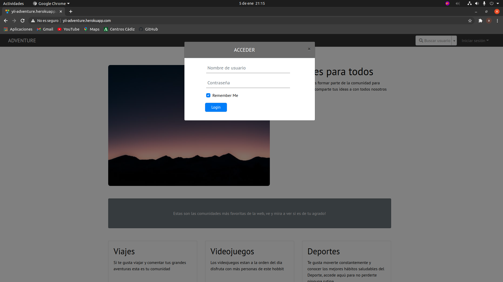
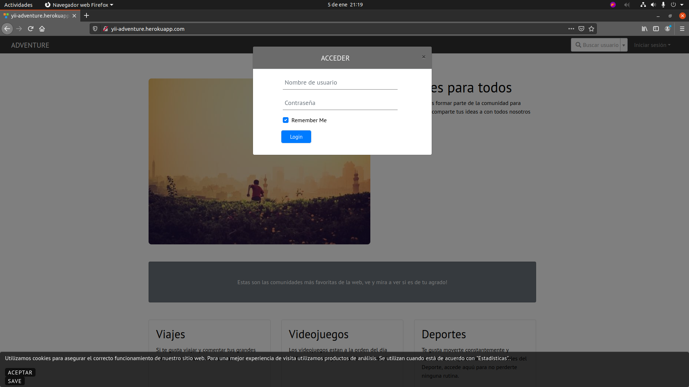
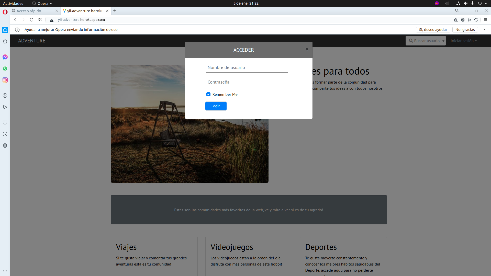
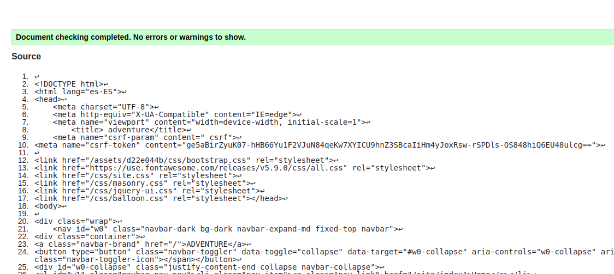
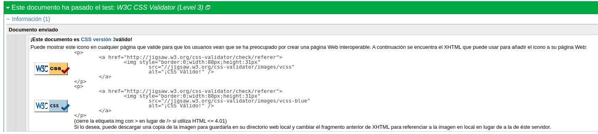
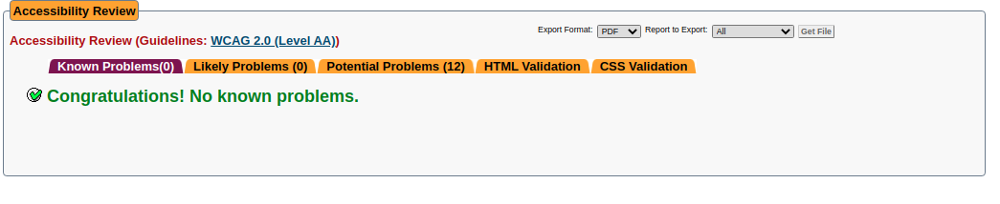
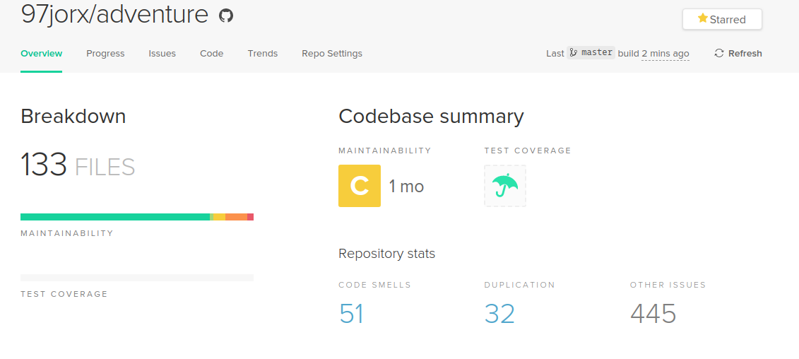

# Anexos

---
### **([R36]()) Varios Navegadores**

#### Chrome

#### Mozilla Firefox

#### Opera

---

### **([R34]()) Validación HTML5, CSS3 y accesibilidad**

### Validación HTML5

[Enlace a la validación HTML5]()

### Validación CSS3

[Enlace a la validación CSS3]()

### Validación de accesibilidad

[Enlace a la validación de accesibilidad]()

### Prueba del seis

<ol>
<li>¿Qué sitio es éste?</li>
  <ul>
    <li>
        La aplicación se conoce donde se encuentra los usuarios que entren a la misma observando el menú de la parte superior además se intuye en todo momento en el menú lateral que parte de la aplicación se redirecciona. 
   </li>
 </ul>
 
<li>¿En qué página estoy?</li>
    <ul>
        <li>
        Todas las paginas pueden ir a todas a partir de migas de pan y el menu que esta en la izquierda que persiste con el usuario a cualquier parte de la aplicación.
       </li>
  </ul>
 
    <li>¿Cuáles son las principales secciones del sitio?</li>
<ul>
    <li>
        Secciones del sitio son Comunidades, Notificaciones, Perfil, Buscar usuario y Blogs que me gustan, Bloqueados. (En caso de estar logueado).
    </li>
</ul>
 

<li>¿Qué opciones tengo en este nivel?</li>
<ul>
    <li>Aparece un menú lateral y un navbar en el cual se redireccionará a la parte de la aplicación en cuestión. En el perfil se dispondrá de TABS para poder seleccionar los comentarios de ese usuario además de los blogs que el usuario haya creado tanto la posibilidad de modificarlos y ver el número de likes.</li>
</ul>
 

<li>¿Dónde estoy en el esquema de las cosas?</li>
<ul>
  <li> 
    En algunas partes de la aplicación se dispondrá de unas migas de pan a parte del menú lateral/sidebar.
 </li>
</ul>
<li>¿Cómo busco algo?</li>
<ul>
    <li>
        Al ser una Red Social para poder compartir blogs, se dispone de un buscador de usuarios para encontrar a las personas más rápido. Dentro de comunidades se puede buscar por el título de la comunidad y por último al acceder a una comunidad, si es necesario, se permite buscar por diferentes campos en los blogs.
   </li>
</ul>
</ol>

---

### **([R38]()) Despliegue en un servidor local**

### **([R34]()) Codeclimate**
